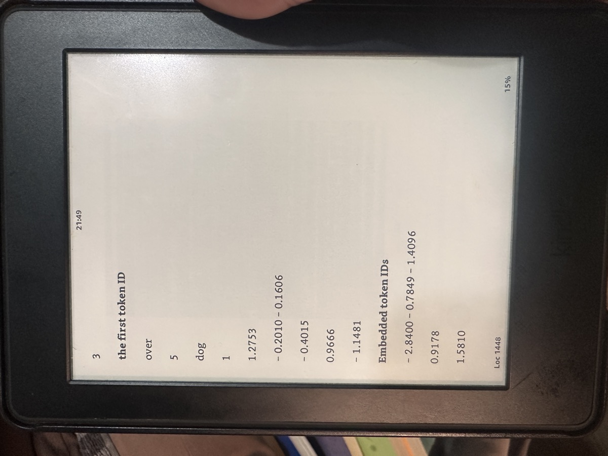
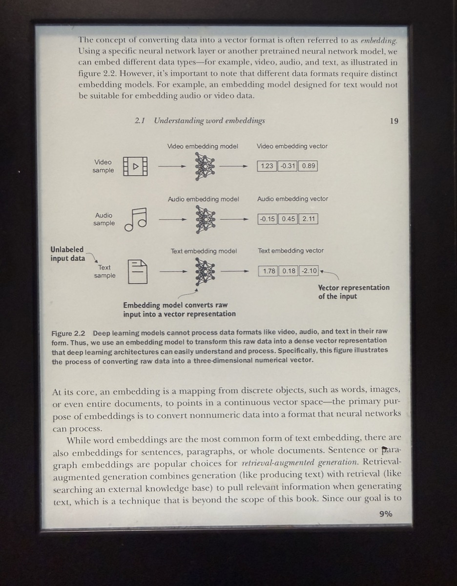

# kindle-pdf-skill

> 治好"技术 PDF 在 Kindle 上排版稀烂"这个老大难。矩阵、代码块、公式完整保留。告别重排灾难。

[English](./README.md) | 简体中文

[](./LICENSE)

一个 [Agent Skill](https://docs.claude.com/en/api/agent-skills)，教会 Claude（以及其他兼容 Agent）正确地把大尺寸技术 PDF 转换成适合 Kindle 阅读的版本——而不会把代码、表格、矩阵、公式的二维结构毁掉。

## 痛点

你下载了一本好书——比如 Sebastian Raschka 的《Build a Large Language Model (From Scratch)》。你把 PDF 拷到 6 寸 Kindle 上打开，看到的是这个：

<p align="center">
  
  &nbsp;&nbsp;&nbsp;
  
</p>
<p align="center"><em>左：Kindle 原生 PDF 重排。右：同一本书，经过这个 skill 处理。</em></p>

左边，一个二维表格被打散成了单列竖排：`3`、`the first token ID`、`over`、`5`、`dog`、`1`、`1.2753`——每个格子各占一行。公式被切碎。代码缩进消失。**这本书没法读了。**

右边，是同一本书经过这个 skill 处理之后的样子：三行带向量标注的示意图（`[1.23, -0.31, 0.89]` …）作为整体保留，图注紧跟其下，章节标题和页码各就各位。

这不是 Kindle 的错，是个根本性的尺寸冲突：

- 技术 PDF 是按 **Letter / B5 纸**排版的（~7-8 英寸宽）
- 6 寸 Kindle 屏幕**可用宽度只有 ~3.5 英寸**
- Kindle 的两种显示模式都救不了：
  - **原始模式**：字太小看不清
  - **重排模式**：Kindle 试图把内容压成单列文本流，把二维结构全毁了

## 解决方案

有个叫 **[k2pdfopt](https://www.willus.com/k2pdfopt/)** 的工具，能把每页 PDF 切成多个设备大小的子页，**保持代码块、表格行作为整体单元**。但 k2pdfopt 有 100+ 个参数，网上大部分教程都把关键参数搞错。

这个 skill 把准确的方案——参数组合、设备配置、要避开的坑、验证步骤——固化下来，**让 Agent 第一次就给你跑对**。

| | 没这个 skill | 有这个 skill |
|---|---|---|
| 需要看的教程 | 5+ 篇博客，大部分写错 | 0——Agent 全程包办 |
| 一次跑对的概率 | ~10% | ~90% |
| 常见地雷（`-mode copy` 不切页、`-rt 0` 强制竖屏失效等）| 每个都踩 | 全部规避 |
| 代码/矩阵/公式保留度 | 看运气 | 有保证 |
| 老款 Kindle 支持（Paperwhite 1/2）| "建议换新" | 专门优化的参数集 |

## 仓库内容

```
skills/kindle-pdf-skill/
├── SKILL.md                          # ~13k 字符——主操作手册
└── references/
    ├── k2pdfopt-flags.md             # 全参数参考 + 设备速查表
    └── security-policy-pitfalls.md   # macOS Gatekeeper、被拦截的 shell 模式
```

skill 涵盖：

- **诊断清单**——读取 PDF 元数据、识别故障模式、选对工具
- **macOS 上 k2pdfopt 安装**——包括如何绕过 Gatekeeper 隔离
- **各代 Kindle 的参数配方**——Paperwhite 1/2（212ppi）、PW3/4（300ppi）、PW5/Signature、Oasis、Scribe
- **横屏 vs 竖屏输出的取舍**——何时用 `-ls-`，何时加 `-fs 1.2`
- **验证方法**——如何确认输出正确（以及为什么 `vision_analyze` 判断旋转不可信）
- **完整避坑清单**——作者亲自踩过的每个雷，让你别再踩

## 安装

### 方式 A：Claude Code 插件（推荐）

```bash
/plugin marketplace add irisfeng/kindle-pdf-skill
/plugin install kindle-pdf-skill@kindle-pdf-skill
```

### 方式 B：Hermes Agent

[Hermes Agent](https://hermes-agent.nousresearch.com/) 从 `~/.hermes/skills/` 加载 skill。克隆本仓库或直接复制 skill 目录：

```bash
mkdir -p ~/.hermes/skills/productivity
cp -r skills/kindle-pdf-skill ~/.hermes/skills/productivity/
```

之后在 Hermes 的新会话里直接说：

> 我的 PDF 在 Kindle 上排版一塌糊涂，帮我修一下。

Agent 会自动加载这个 skill。

### 方式 C：手动 / 其他 Agent

整个 skill 就是 [`skills/kindle-pdf-skill/SKILL.md`](./skills/kindle-pdf-skill/SKILL.md)，自包含的 Markdown 文档。可以直接喂给任何支持自定义指令的 Agent 系统（Cursor rules、Codex prompts、ChatGPT 自定义指令等）。

## 怎么用

装好之后，直接用日常语言描述问题。Agent 会：

1. 检查你的 PDF（页面尺寸、内容类型、扫描版还是原生 PDF）
2. 识别你的 Kindle 型号（如果你不确定，会让你发张照片——Paperwhite 2 和 Paperwhite 5 长得完全不一样）
3. 如有需要，安装 k2pdfopt（并告诉你如何绕过 macOS Gatekeeper）
4. 用针对你设备的正确参数执行转换
5. 验证输出（并提醒你横屏-竖屏的取舍）

能正确触发本 skill 的示例语句：

- "我的 PDF 在 Kindle 上看起来一塌糊涂"
- "怎么让技术 PDF 在 6 寸电子书上能读？"
- "PDF排版在Kindle上一塌糊涂"
- "帮我把这个 PDF 转成适合 Paperwhite 看的"

## 这玩意儿为什么会存在

我（[@irisfeng](https://github.com/irisfeng)）有台老款 Kindle Paperwhite 2 和一堆 ML / 数学 / CS 的 PDF。网上每篇"PDF 转 Kindle"的教程不是这个错就是那个错：

- 推荐 Calibre（毁掉技术排版）
- 推荐转 mobi/AZW3（用另一种方式毁掉技术排版）
- 用错的 k2pdfopt 参数（最经典的——`-mode copy` 其实**不会**切页）
- 默认你有最新的 Kindle Scribe

这个 skill 是我和 [Hermes Agent](https://hermes-agent.nousresearch.com/) 一通迭代调试的产物——所有错路都走过、所有地雷都踩过，最后把能跑通的方案固化下来，不让它消失在某次会话之后。这就是 skill 的意义——把昂贵的教训变成廉价的可复用知识。

## 贡献

欢迎 PR，尤其是这些方向：

- 非 Kindle 设备的参数配方（Kobo、Boox、reMarkable 等）
- 把 skill 翻译成其他语言
- 你发现的新坑

除了 typo 修正，请先开 Issue 讨论再 PR。

## 致谢

- **[willus](https://www.willus.com/)**——k2pdfopt 作者，电子墨水阅读器世界的无名英雄
- **[Sebastian Raschka](https://sebastianraschka.com/)**——他的《Build a LLM from Scratch》是触发整件事的导火索
- **[Anthropic](https://github.com/anthropics/skills)**、**[Matt Pocock](https://github.com/mattpocock/skills)**、**[JimLiu](https://github.com/JimLiu/baoyu-skills)**、**[multica-ai](https://github.com/multica-ai/andrej-karpathy-skills)**——开源 skill 仓库的最佳实践，本仓库结构跟它们学的
- **[Hermes Agent](https://hermes-agent.nousresearch.com/)**——这个 skill 在它身上诞生

## 协议

[MIT](./LICENSE) © 2026 偷泥方 (irisfeng)
